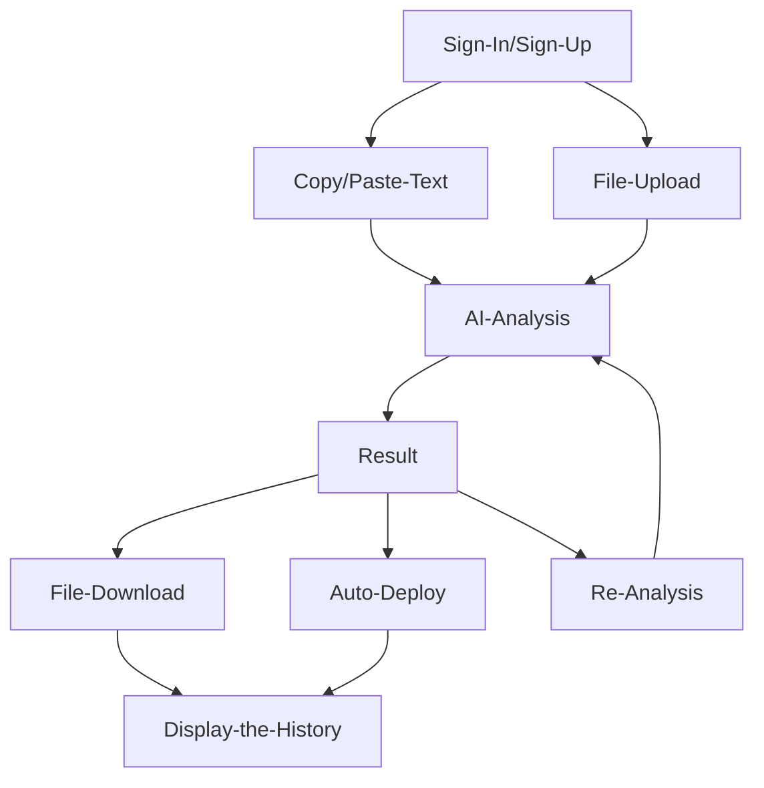

# ETH Online 2024
`Review of participation in the 18 hackathon.`

[Github repo](https://github.com/Julius-Ky/eth-global-various) | [Demo Site](https://eth-various.vercel.app/#)

## Overview
- As the blockchain technology and cryptocurrency markets continue to grow, security issues and malicious activities are also on the rise. Phishing, scams, and malicious contract codes are major concerns, especially as they often originate from compromised smart contract code and wallet approvals. 
In response to this, we propose an AI-powered platform for analyzing, modifying, and improving smart contract codes, providing detailed reports on identified issues and applied fixes.

> ✨If you want to see details, go to the [Showcase]()

### Team
We formed a team together by recruiting team members directly from the Discord channel.
- Project Manager 1
- Smart Contract 2
- AI Engineer 1
- Front-end Developer 1

### What i did
👨🏼‍💻 Role: Product & Project Manager (PM)
- Ideation
- Planning
- Research about market, competitors, referrence
- Determine development priorities and organize strategic sponsor tracks
- Checek the Schedule
- Make the Architecture | User Flow
- Summary for the meeting reports & Submmit contents

### Track
- *Hedera*
- *Galadriel*
- *Web3Auth*

## Project

### ETH Various

Galadriel AI based Analyse smart contract coed files, Contract Address to detect vulnerabilities and other breaches, automatically code edit and result the reports.

### Solution

**`Preventive Security Checks`**: Users upload their smart contract code, which the AI analyzes for security vulnerabilities, code flaws, and potential scams.

**`Automated Corrections and Enhancements`**: Based on the analysis, the AI suggests and implements modifications to improve the contract code, including applying security patches and optimizing performance.

**`Detailed Reporting`**: The platform generates comprehensive reports detailing the issues found, modifications made, and explanations to help users understand the improvements.

**`Automatic Deployment`**: The modified smart contract can be deployed directly through the platform. This allows users to instantly deploy the analyzed or corrected code without needing to use external tools like Remix.

**`Ease of Use`**: Unlike existing professional auditing firms like Certik and Hacken, our platform offers an easily accessible preliminary self-audit service. This enables developers and project teams to address security issues early in the development process, making the final professional audit more efficient and streamlined.

### User Journey

### Result
- Hedera - Hedera-Native Services Starter Bounty
