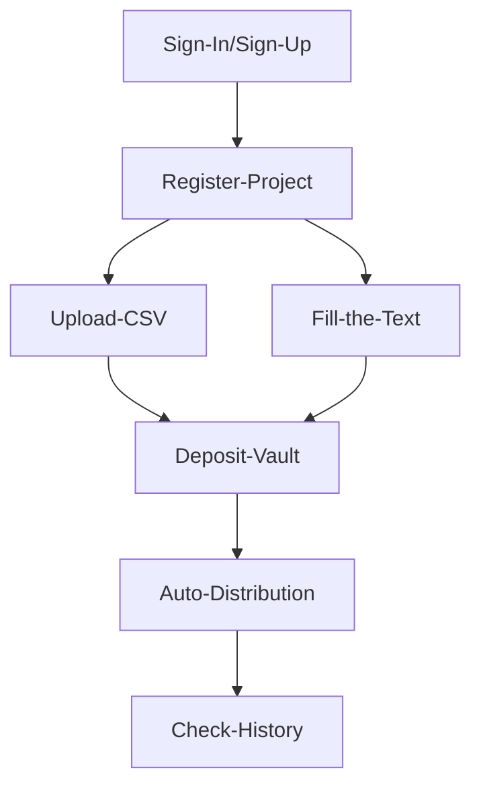

# ETH Online 2024

`Review of participation in the 18 hackathon.`

## Contents
- [Github repo](https://github.com/AeroDump/contracts) | [Demo Site](https://aerodump.vercel.app/)

### Overview:
Cutting-edge platform designed to simplify and automate the distribution of tokens for users and project owners across multiple blockchain networks.

✨If you want to see details, go to the [Showcase](https://ethglobal.com/showcase/aerodump-4z48m)

### Background:
We formed a team together by recruiting team members directly from the Discord channel and Telegram.
- Project Manager 1
- Smart Contract 2
- Software Engineer 2

### Track:

- *LayerZero*
- *Sign Protocol*
- *Chainlink*
- *Web3Auth*

### Project:

> **AeroDump**

`AeroDump` is a cutting-edge platform designed to simplify and automate the distribution of tokens for users and project owners across multiple blockchain networks. Built to support airdrops, marketing event rewards, and large-scale token transfers, AeroDump leverages the power of automation, cross-chain interoperability, and secure vaults to provide an efficient, hands-free solution for bulk token distribution.

> **Architecture**

> **User Journey**

### Result:
- Not yet

### Reason for falling (Feedback from ETHGlobal judges):
- Not yet

### Areas for improvement:
1) Overall, AeroDump's service is a service that includes detailed development elements and functions. Therefore, we exchange opinions on the requirements for each sponsor track we will submit, what technology we will use and how we will do it, the current status of the project, how users use the platform, and how the platform should operate. I had to share my opinion with the development team members about this, but since I lack a bit of knowledge in the technical area, it was a bit difficult to talk about it, and there were situations where we couldn't understand each other, which was disappointing. (However, in this regard, I tried to understand what the developer and project manager was talking about by asking an experienced developer who was in the middle of me to understand what he was saying and what he wanted. Afterwards, we were able to further develop the platform's functions and operating principles by gaining sufficient understanding with the developer.)
2) In situations like the one above, I, as the project manager, should have played that role, but instead I asked for help from the development team members and received it, so I felt a little disappointed with myself and felt like I was still lacking.
3) English presentation required

### Positive aspects:
- When presenting the initial idea, I simply expressed it as text, and the team members caught on to it well, found it interesting and thought it was a good idea, and I felt it was really cool and amazing that they actually implemented it.
> initial idea

### Things I learned from the hackathon:
- I tried to provide a multi-chain service using Chainlink's CCIP, but a development team member did research and found that Layer Zero also provides CCIP, so since we are using the vault service at Layer Zero anyway, I suggested that we also utilize CCIP as well, so Layer Zero I found out that it also provides CCIP functionality. (After thinking about it, I thought that Layer Zero is also a bridge service and would provide sufficient CCIP functions.)
- I learned from the development team members that this logic is quite tricky and difficult when using Chainlink automation to automate the contract code so that the contract can be automatically executed in the Layer Zero vault and distributed to the wallets of desired users. It is done. Simply, since the function called Chainlink Automation is specialized for automation, I thought that it would be possible to just add the contract address to be automated within a few lines of code, but it was not true and was only shared that it was a little more complicated, so I first learned about it.

### What i did
👨🏼‍💻 Role: Product & Project Manager (PM)

- Ideation
- Planning
- Research about market, competitors, referrence
- Determine development priorities and organize strategic sponsor tracks
- Checek the Schedule
- Make the Architecture | User Flow
- Summary for the meeting reports & Submmit contents
