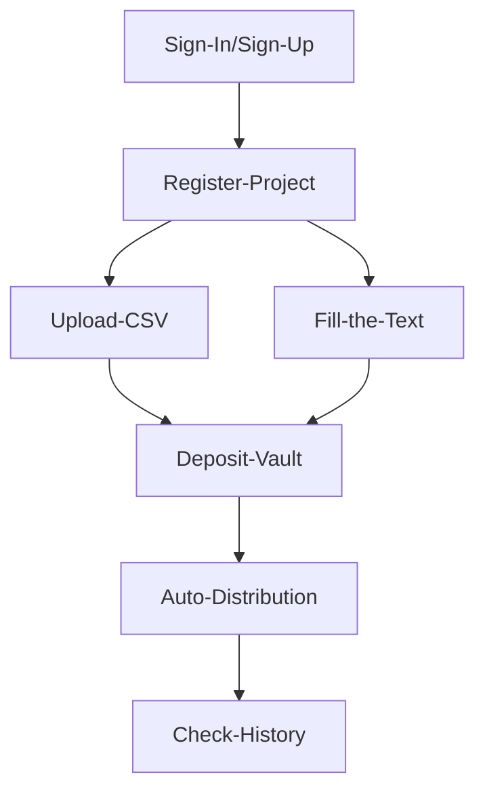

# ETH Online 2024

`Review of participation in the 18 hackathon.`

## Contents
- [Github repo](https://github.com/AeroDump/contracts) | [Demo Site](https://aerodump.vercel.app/)

### Overview:
Cutting-edge platform designed to simplify and automate the distribution of tokens for users and project owners across multiple blockchain networks.

✨If you want to see details, go to the [Showcase](https://ethglobal.com/showcase/aerodump-4z48m)

---
### Background:
We formed a team together by recruiting team members directly from the Discord channel and Telegram.
- Project Manager 1
- Smart Contract 2
- Software Engineer 2

---
### Track:

- *LayerZero*
- *Sign Protocol*
- *Chainlink*
- *Web3Auth*

---
### Project:

> **AeroDump**

`AeroDump` is a cutting-edge platform designed to simplify and automate the distribution of tokens for users and project owners across multiple blockchain networks. Built to support airdrops, marketing event rewards, and large-scale token transfers, AeroDump leverages the power of automation, cross-chain interoperability, and secure vaults to provide an efficient, hands-free solution for bulk token distribution.

> **Architecture**

> **User Journey**

---
### Build Tools
      

---
### Result:
- Not yet

---
### Reason for falling (Feedback from ETHGlobal judges):
- Not yet

---
### Areas for improvement:
1) Whenever I participate in any hackathon, I continue developing until 1 hour before the final submission deadline and submit it 5 or 3 minutes before the deadline. I think this is largely my fault as a project manager who cannot manage the schedule properly. (The reason for developing before the deadline is to complete it perfectly or because there are deficiencies in the demo platform, but I think that if you figure this out in advance according to the schedule and fix it quickly, you can submit it with enough leisure.)
2) Because the front-end developer did not proceed with development without contact, there were not enough developers to develop the front-end. I knew this, but I think the problem of neglecting it is a big problem for me as a project manager. So, although both the backend and AI model were perfect, there was no frontend part that could run an actual demo, so there may have been things that seemed very incomplete. (If the developer did not contact you during the hackathon period, we made a bold decision and hired a new frontend developer. I think that it is necessary to find them and immediately put them into the project. I think this is also one of the roles of the project manager in order to fill in all empty spaces in the project within the period and produce good results.)
3) English presentation required

---
### Positive aspects:
- Since the AI ​​engineer did not know much about blockchain, he had to study in parallel while developing the model. However, she developed a very good AI model by continuing to study until the end, understanding it on her own, and communicating with developers who knew smart contract code among our team members.
Therefore, during the local demo, an amazing project emerged, so it was great to think that the AI ​​model could be considered a model to the extent that it could be used not only for this hackathon but also for actual projects.
- Since there was no front end, the demo platform lacked quality and was unable to be fully functionally integrated, so the submission was closed. However, the rest of the team tried to integrate it until the end, and the front end was also briefly developed and uploaded to the server, so a demo link was created and an image was able to show what kind of platform it was.
- Since this hackathon was a Hedera hackathon, there was a lack of edge points on how to use Hedera, but the team members thought together and used a message in a place called Topic within the Hedera contract to provide the results of the analysis to our platform. The idea was to store the data in on-chain storage by putting it in a part. So, we were able to utilize this idea by linking it to a business model on our platform.

---
### Things I learned from the hackathon:

---
### What i did
👨🏼‍💻 Role: Product & Project Manager (PM)

- Ideation
- Planning
- Research about market, competitors, referrence
- Determine development priorities and organize strategic sponsor tracks
- Checek the Schedule
- Make the Architecture | User Flow
- Summary for the meeting reports & Submmit contents
