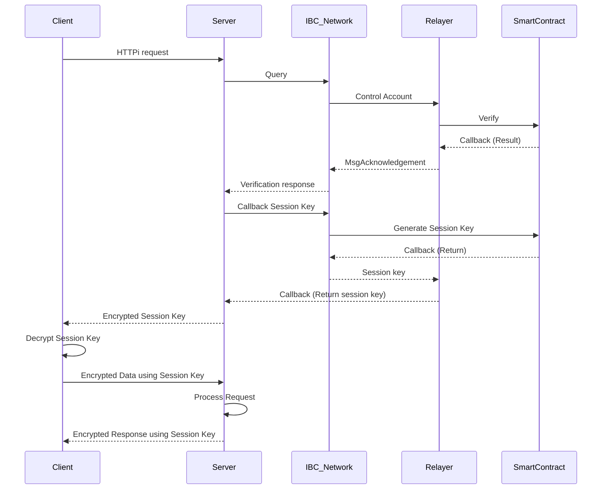

# Ideahacker's Guide to IBC
`Review of participation in the 20 hackathon.`

[Pitchdeck](https://www.figma.com/slides/z4Q9VwVO7cOML23Vl3MzvG/IBC-Ideathon?node-id=1-571&t=Eg1IgkbV4Ot937qO-1) | [Idea Build](https://ipfs.filebase.io/ipfs/QmVC9XGvYyzecpW4vWCLfRt8tXY8UuR9yiFzDaUHvrjdnA) | [Video](https://youtu.be/LCUlg14N3KM)

## Overview
- HTTPi is a next-generation communication protocol designed to revolutionize how secure data exchange occurs between clients and servers by leveraging Inter-Blockchain Communication (IBC). Unlike HTTPS, which relies on centralized certification authorities (CAs), HTTPi replaces these with blockchain-based decentralized trust mechanisms. By using the IBC network, HTTPi allows for the secure generation, verification, and distribution of session keys, ensuring robust integrity, transparency, and security throughout communication processes. This decentralized solution eliminates single points of failure while enabling transparent cross-chain communication.

> ✨If you want to see details, go to the [Showcase](https://dorahacks.io/buidl/17793/)

### Team
We formed a team together by recruiting team members directly from the Discord channel.
- Product Manager 1
- Product Designer 1
- Business Developer 1

### What i did
👨🏼‍💻 Role: Product & Project Manager (PM)
- Planning
- Research about market, competitors, referrence
- Checek the Schedule
- Make the Architecture | Demo video
- Presentation
- Summary for the meeting reports & Submmit contents

### Track
- *Wild Card*

## Project

  

### Diagran

### Result
- Not yet

### Reason for falling (Feedback from Aptos judges)
- Not yet

### Areas for improvement
1) There was nothing lacking or disappointing about this hackathon. Overall, the development team members responded well and followed along well. In addition, we took charge of each task professionally, identified and completed them, and perfectly implemented the MVP version we were aiming for within the period.
2) English presentation required

### Positive aspects
- It was very nice that I simply created a prototype layout and shared it with them, and they developed the front page perfectly based on that. Also, there were no complaints or complaints about this, and people comfortably shared their opinions that something was lacking or would be good if it were modified, and added additional opinions about why this was necessary, so it was easier to understand and accept it.

### Things I learned from the hackathon
- I realized once again that it would be easier to work on the front-end if you could create a simple prototype (layout) and share it. I think it's because it's faster and easier to understand if the planner expresses what kind of screen they want in a drawing and shares it.
- I first learned that there was a platform service called `Superteam` in the Solana ecosystem that shared ideas in this web3 format. I didn't know that this platform was actually commercialized, but I was surprised that it already existed. I learned that there are so many different ideas in the current web3 market that are already commercialized but not yet known, and I thought and learned that I should do more market research.
