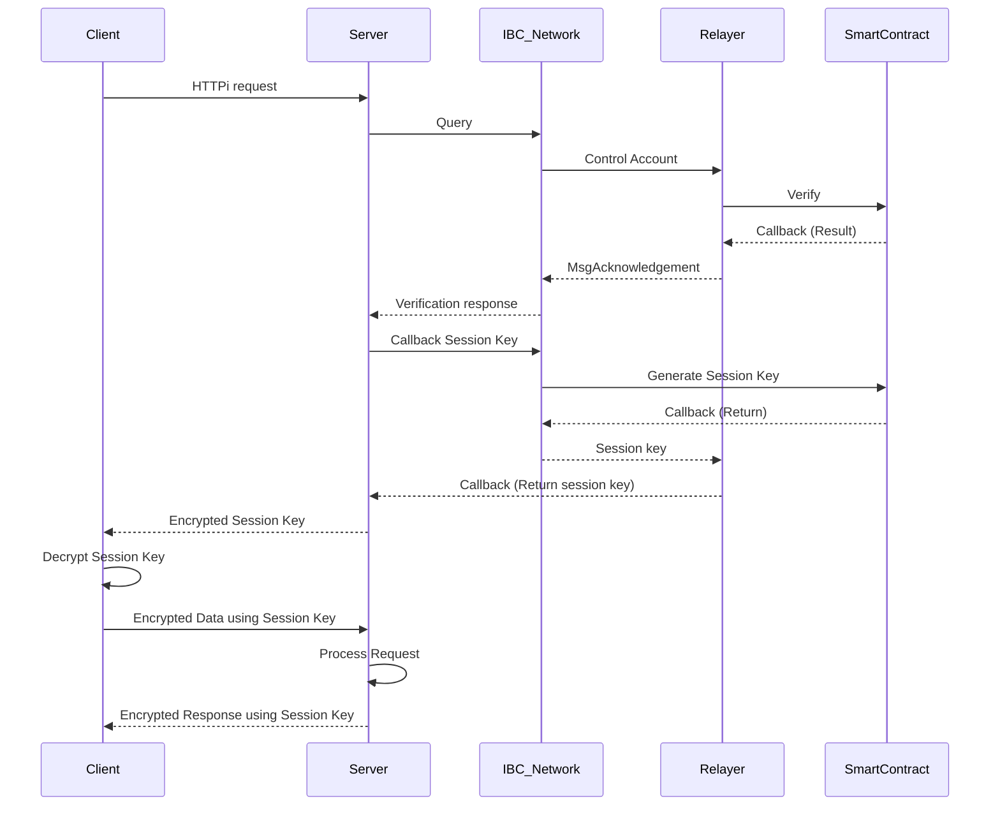

# [REDACTED] Hackathon
`Review of participation in the 21 hackathon.`

[Demo](https://reception-seven.vercel.app/) | [Pitchdeck](https://drive.google.com/file/d/1gn9eo1JHbGmijGPWTwsq1gkfCLY_8rKp/view?usp=sharing) | [Github](https://github.com/Julius-Ky/reCeption) | [Video](https://youtu.be/puJjyTeLRjY)

## Overview
- HTTPi is a next-generation communication protocol designed to revolutionize how secure data exchange occurs between clients and servers by leveraging Inter-Blockchain Communication (IBC). Unlike HTTPS, which relies on centralized certification authorities (CAs), HTTPi replaces these with blockchain-based decentralized trust mechanisms. By using the IBC network, HTTPi allows for the secure generation, verification, and distribution of session keys, ensuring robust integrity, transparency, and security throughout communication processes. This decentralized solution eliminates single points of failure while enabling transparent cross-chain communication.

> ✨If you want to see details, go to the [Showcase](https://dorahacks.io/buidl/17793/)

### Team
We formed a team together by recruiting team members directly from the Discord channel.
- Product Manager 1
- Product Designer 1
- Business Developer 1

### What i did
👨🏼‍💻 Role: Product & Project Manager (PM)
- Planning
- Research about market, competitors, referrence
- Checek the Schedule
- Make the Architecture | Demo video
- Presentation
- Summary for the meeting reports & Submmit contents

### Track
- *Wild Card*

## Project

  

### Diagram

### Result
- Not yet

### Reason for falling (Feedback from Aptos judges)
- Not yet

### Areas for improvement
1) Because of the lack of knowledge about IBC technology, there were many inconveniences and difficulties in configuring the architecture at this Ideathon. In addition, it was difficult to combine the blockchain IBC protocol with network communication data without much knowledge of TCP/IP network protocols such as HTTP/HTTPS. We completed the architecture by referring to reference materials and other principles in a format that was as plausible and functional as possible.
2) English presentation required.

### Positive aspects
- Since there were not many team members with technical knowledge and all team members had good business-related skills and abilities such as copywriters, technical aspects were important in this Ideathon, but the direction and method of emphasizing and expressing the business aspects of the idea were very important. I think we were able to produce a good result because we were outstanding and had strong and diverse ways to appeal to the judges.

### Things I learned from the hackathon
- I learned what the IBC protocol is and what technologies it provides.
- I learned that the IBC protocol is a cross-chain and Cosmos hub ecosystem, and that their goal is similar to the blockchain Internet protocol and is to provide a hub (router)-like role in the blockchain ecosystem.
